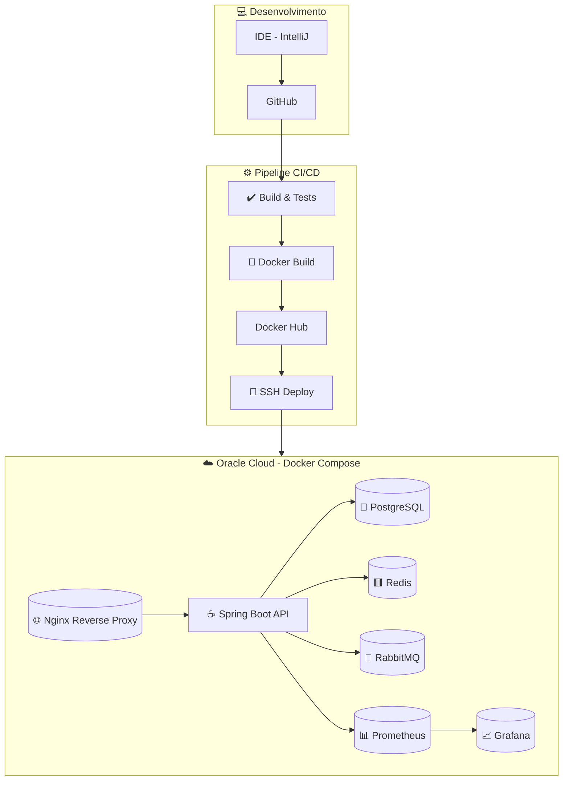

# BackEnd Java Gerador de Pix + Infra Completa

Aplicação Java Spring Boot que demonstra uma arquitetura moderna utilizando mensageria, cache, monitoramento e automação de deploy na nuvem.  
O projeto inclui **RabbitMQ, Redis, Prometheus, Grafana, Docker Compose** e pipeline de **CI/CD com GitHub Actions** tudo em containers localizados em uma vm na Oracle Cloud. 


## Acessos
-   [Documentação API](https://payment.meagende.site/swagger-ui/index.html)
 -   [Repositóiro com a Infra completa](https://github.com/JoaoUntura/dockercompose_payments)
 - [API](https://payment.meagende.site/)
 - [Grafana](http://163.176.132.56:3000/) ->  admin / admin

## Objetivo

A aplicação tem o objetivo de **gerar QR Codes em formato Pix**, seguindo as normas do Banco Central do Brasil.  

Funcionalidades principais:  
- Cadastro de **Receivers** (recebedores) com suas respectivas **chaves Pix**  
- Registro de **produtos** e seus **valores**  
- Geração de **QR Codes Pix dinâmicos** vinculados ao receiver e ao produto escolhido  

## 🏗 Arquitetura / Infraestrutura



## Aprendizados

O que você aprendeu construindo esse projeto? 

Este projeto foi desenvolvido com o objetivo de demonstrar:  
- **Boas práticas em desenvolvimento backend com Spring Boot, com estrutura em camadas** 
 - **Boas práticas de Testes Unitários e de Integração** 
- **Integração de mensageria com RabbitMQ**  
- **Uso de cache e persistência em memória com Redis**  
- **Monitoramento de métricas com Prometheus e visualização com Grafana**  
- **Infraestrutura containerizada via Docker Compose**  
- **Pipeline de CI/CD automatizada com GitHub Actions**


## Stack utilizada

Java 21

Postgres

Spring Boot 3.x

Maven/Gradle

Docker & Docker Compose

Redis

RabbitMQ

Prometheus & Grafana

GitHub Actions (CI/CD)


## Deploy

Rode localmente com:

```bash
  git clone https://github.com/JoaoUntura/dockercompose_payments
```
```bash
  sudo docker compose pull
```
```bash
  sudo docker compose up -d
```


## CI / CD

[Link da Pipeline](https://github.com/JoaoUntura/Java-API-Payments/blob/main/.github/workflows/main.yml)


Este projeto conta com pipeline no GitHub Actions, que realiza:

Build da aplicação

Execução de testes automatizados

Build e push da imagem Docker

Deploy em servidor remoto via ssh em Vm da Oracle Cloud
